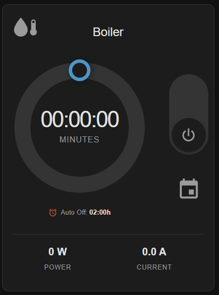
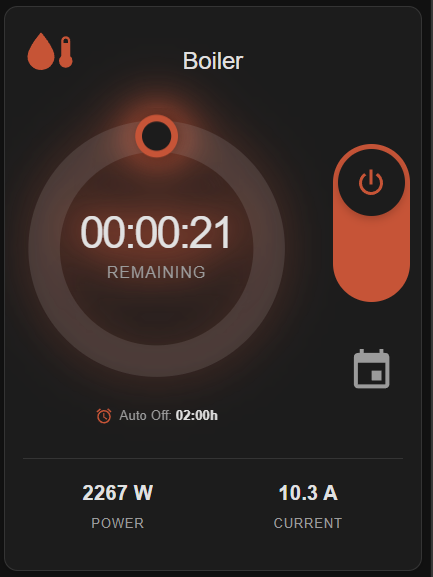
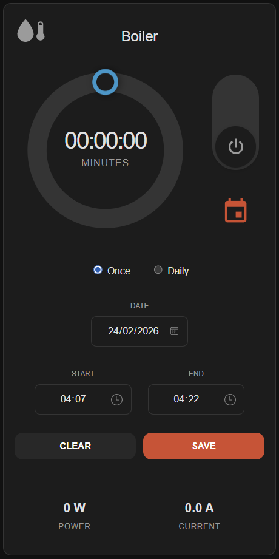

# Switcher Donut Card

A custom Lovelace card for Home Assistant to control **Switcher Touch** water heaters (boilers) with an intuitive circular timer interface, real-time monitoring, and scheduling capabilities.

---

## Screenshots

| Stopped | Running | Scheduler |
|---------|---------|-----------|
|  |  |  |

---

## Features

✨ **Interactive Timer Control**
- Drag-and-drop circular interface for setting heating duration
- Visual feedback with animated heating effect
- Supports up to multiple hours with smooth multi-revolution dragging
- Displays remaining time in HH:MM:SS format with live countdown

⚡ **Smart Toggle Behavior**
- Quick ON/OFF with toggle switch
- Automatically uses auto-shutdown time when toggled without timer
- Custom timer duration when donut is dragged

📊 **Real-Time Monitoring**
- Live power consumption display (Watts)
- Current draw monitoring (Amperes)
- Auto-shutdown timer display
- All monitoring fields are optional

📅 **Advanced Scheduler**
- Single (one-time) or recurring schedules
- Day-of-week selection for repeated schedules
- Visual feedback with calendar icon color states
- Easy YAML configuration wizard

🎨 **Customizable Appearance**
- Full dark mode support with CSS variables
- Customizable icon and size
- Optional card title
- Heating pulse animation with orange glow
- Smooth transitions and animations

🔔 **Notification System**
- Internal Home Assistant notification when boiler turns ON
- Internal + push notifications when timer completes
- No interruptions when manually turning OFF

---

## Table of Contents

- [Installation](#installation)
- [Configuration](#configuration)
  - [Minimal Configuration](#minimal-configuration)
  - [Full Configuration](#full-configuration)
  - [Configuration Options](#configuration-options)
- [Scheduler Setup](#scheduler-setup)
  - [Helper Entities](#helper-entities)
  - [Automation](#automation)
  - [Complete YAML Example](#complete-yaml-example)
- [Usage Guide](#usage-guide)
- [Troubleshooting](#troubleshooting)
- [Development](#development)

---

## Installation

This card is available as a public GitHub repository. HACS support may be added in the future.

### Method 1: Download from GitHub

1. Download the latest `switcher-donut.js` file from the [GitHub repository](https://github.com/Pakingster/switcher-donut-card) (check the `dist` folder)

2. Copy the file to your Home Assistant's `config/www/` directory:
   ```
   config/
   └── www/
       └── switcher-donut.js
   ```

3. Add the resource to your Lovelace dashboard:
   
   **Via UI:**
   - Navigate to **Settings** → **Dashboards** → **Resources**
   - Click **+ Add Resource**
   - URL: `/local/switcher-donut.js`
   - Resource type: **JavaScript Module**
   - Click **Create**

   **Via YAML:**
   ```yaml
   resources:
     - url: /local/switcher-donut.js
       type: module
   ```

4. Restart Home Assistant and clear your browser cache (Ctrl+F5)

---

## Configuration

The card can be configured via the visual editor or YAML. Only two entities are required to get started.

### Minimal Configuration

The simplest setup requires only the switch entity and remaining time sensor:

```yaml
type: custom:switcher-donut-card
entity: switch.boiler
time_entity: sensor.boiler_remaining_time
```

### Full Configuration

Complete configuration with all optional features enabled:

```yaml
type: custom:switcher-donut-card
title: Kitchen Boiler
entity: switch.boiler
time_entity: sensor.boiler_remaining_time
power_entity: sensor.boiler_power
current_entity: sensor.boiler_current
boiler_auto_shutdown: sensor.boiler_auto_shutdown
icon: mdi:water-boiler
icon_size: 32px
```

### Configuration Options

| Parameter | Type | Required | Default | Description |
|-----------|------|----------|---------|-------------|
| `type` | string | **Yes** | - | Must be `custom:switcher-donut-card` |
| `entity` | string | **Yes** | - | Switcher Touch switch entity (domain: `switch`) |
| `time_entity` | string | **Yes** | - | Remaining time sensor in HH:MM:SS format (domain: `sensor`) |
| `title` | string | No | - | Optional card title displayed at the top |
| `power_entity` | string | No | - | Power consumption sensor in Watts (domain: `sensor`) |
| `current_entity` | string | No | - | Current sensor in Amperes (domain: `sensor`) |
| `boiler_auto_shutdown` | string | No | - | Auto-shutdown timer sensor in HH:MM:SS format (domain: `sensor`) |
| `icon` | string | No | `mdi:water-thermometer` | Card icon - any [Material Design Icon](https://pictogrammers.com/library/mdi/) |
| `icon_size` | string | No | `28px` | Size of the card icon (e.g., `32px`, `2rem`) |

#### Entity Requirements

**Required Entities:**
- `entity`: Must be a `switch` domain entity for your Switcher Touch device
- `time_entity`: Must return time in `HH:MM:SS` format (e.g., `01:23:45`)

**Optional Entities:**
- `power_entity`: Must return numeric value in Watts
- `current_entity`: Must return numeric value in Amperes (will be displayed with 1 decimal place)
- `boiler_auto_shutdown`: Must return time in `HH:MM:SS` format (will be displayed as `HH:MMh`)

**Note:** Optional entities only appear in the UI when configured AND available. If an optional entity becomes unavailable, that information row will hide automatically.

#### Icon Customization

You can use any icon from the [Material Design Icons](https://pictogrammers.com/library/mdi/) library.

---

## Scheduler Setup

The scheduler feature allows you to automatically turn on your boiler at specific times, either once or on a recurring schedule.

> 💡 **The scheduler is completely optional.** The card works perfectly without it. The calendar icon only appears when helper entities are configured.

### Quick Setup Guide

1. **Add the card** to your dashboard with the basic configuration
2. **Click the calendar icon** 📅 (it will show instructions if helpers aren't set up)
3. **Follow the automated wizard** that provides ready-to-use YAML
4. **Copy the YAML** to your `configuration.yaml`
5. **Restart Home Assistant**
6. **Create the automation** using the provided YAML
7. **Done!** The scheduler is ready to use

### Helper Entities

The scheduler requires 12 helper entities to store schedule settings. Add these to your `configuration.yaml`:

```yaml
# Time Selection Helpers
input_datetime:
  boiler_schedule_start:
    name: Boiler Schedule Start Time
    has_date: false
    has_time: true
    icon: mdi:clock-start

  boiler_schedule_end:
    name: Boiler Schedule End Time
    has_date: false
    has_time: true
    icon: mdi:clock-end

  boiler_schedule_date:
    name: Boiler Schedule Date
    has_date: true
    has_time: false
    icon: mdi:calendar

# Schedule Mode Selection
input_select:
  boiler_schedule_mode:
    name: Boiler Schedule Mode
    icon: mdi:calendar-sync
    options:
      - single
      - repeat

# Schedule Enable/Disable
input_boolean:
  boiler_schedule_enabled:
    name: Enable Boiler Schedule
    icon: mdi:calendar-check

  # Day of Week Helpers (for recurring schedules)
  boiler_schedule_mon:
    name: Monday
    icon: mdi:calendar-blank

  boiler_schedule_tue:
    name: Tuesday
    icon: mdi:calendar-blank

  boiler_schedule_wed:
    name: Wednesday
    icon: mdi:calendar-blank

  boiler_schedule_thu:
    name: Thursday
    icon: mdi:calendar-blank

  boiler_schedule_fri:
    name: Friday
    icon: mdi:calendar-blank

  boiler_schedule_sat:
    name: Saturday
    icon: mdi:calendar-blank

  boiler_schedule_sun:
    name: Sunday
    icon: mdi:calendar-blank
```

**After adding to `configuration.yaml`:**
1. Save the file
2. Go to **Settings** → **System** → **Restart Home Assistant**
3. Or use **Developer Tools** → **YAML** → **Restart** (requires YAML configuration reload)

### Automation

Create an automation to execute the scheduled tasks. This automation checks every minute and triggers when conditions match.

Navigate to **Settings** → **Automations & Scenes** → **Create Automation** → **Edit in YAML**, and paste:

```yaml
alias: Switcher Boiler Scheduler
description: Automatically turn on boiler based on schedule
trigger:
  - platform: time_pattern
    minutes: "*"
condition:
  - condition: state
    entity_id: input_boolean.boiler_schedule_enabled
    state: "on"
  - condition: template
    value_template: >
      {% set current_time = now().strftime('%H:%M') %}
      
      {{ current_time == start_time }}
  - condition: or
    conditions:
      - condition: and
        conditions:
          - condition: state
            entity_id: input_select.boiler_schedule_mode
            state: repeat
          - condition: template
            value_template: >
              
              {% set today = now().strftime('%a').lower() %}
              
              {{ is_state(entity, 'on') }}
      - condition: and
        conditions:
          - condition: state
            entity_id: input_select.boiler_schedule_mode
            state: single
          - condition: template
            value_template: >
              
              {% set today = now().strftime('%Y-%m-%d') %}
              {{ schedule_date == today }}
action:
  - variables:
      start_time: "{{ states('input_datetime.boiler_schedule_start')[0:5] }}"
      end_time: "{{ states('input_datetime.boiler_schedule_end')[0:5] }}"
      start_dt: "{{ today_at(start_time) }}"
      end_dt: "{{ today_at(end_time) }}"
      duration_seconds: >
        
          {{ (end_dt - start_dt).total_seconds() | int }}
        
          {{ ((end_dt + timedelta(days=1)) - start_dt).total_seconds() | int }}
        
      duration_minutes: "{{ (duration_seconds / 60) | int }}"
  - service: switcher_kis.turn_on_with_timer
    data:
      entity_id: switch.boiler
      timer_minutes: "{{ duration_minutes }}"
  - service: persistent_notification.create
    data:
      title: ♨️ Boiler Scheduled Start
      message: >
        Boiler turned ON via schedule for {{ duration_minutes }} minutes
      notification_id: boiler_scheduled_start
mode: single
```

> ⚠️ **Important:** Replace `switch.boiler` on line 66 with your actual Switcher entity ID.

### Helper Entity Reference

| Entity Type | Entity ID | Purpose | Values |
|-------------|-----------|---------|--------|
| `input_datetime` | `input_datetime.boiler_schedule_start` | Schedule start time | HH:MM format |
| `input_datetime` | `input_datetime.boiler_schedule_end` | Schedule end time | HH:MM format |
| `input_datetime` | `input_datetime.boiler_schedule_date` | Schedule date (single mode) | YYYY-MM-DD format |
| `input_select` | `input_select.boiler_schedule_mode` | Schedule mode | `single` or `repeat` |
| `input_boolean` | `input_boolean.boiler_schedule_enabled` | Master enable/disable | `on` or `off` |
| `input_boolean` | `input_boolean.boiler_schedule_mon` | Monday selection | `on` or `off` |
| `input_boolean` | `input_boolean.boiler_schedule_tue` | Tuesday selection | `on` or `off` |
| `input_boolean` | `input_boolean.boiler_schedule_wed` | Wednesday selection | `on` or `off` |
| `input_boolean` | `input_boolean.boiler_schedule_thu` | Thursday selection | `on` or `off` |
| `input_boolean` | `input_boolean.boiler_schedule_fri` | Friday selection | `on` or `off` |
| `input_boolean` | `input_boolean.boiler_schedule_sat` | Saturday selection | `on` or `off` |
| `input_boolean` | `input_boolean.boiler_schedule_sun` | Sunday selection | `on` or `off` |

---

## Usage Guide

### Setting Timer Duration

**Drag the Donut**
1. Click and hold anywhere on the circular donut
2. Drag clockwise to increase time, counter-clockwise to decrease
3. Each complete rotation adds 60 minutes
4. Release to activate - the boiler will turn on immediately with your selected duration

**Visual Feedback**
- The orange arc shows your selected duration
- The timer displays in HH:MM:SS format during operation
- Seconds countdown provides precise time tracking

### Toggle Switch

The toggle switch provides quick ON/OFF control with smart behavior:

**When OFF → Turn ON:**
- **With donut dragged** - Uses your custom timer duration
- **Without donut drag** - Automatically uses the auto-shutdown time setting from your boiler
- Sends internal Home Assistant notification

**When ON → Turn OFF:**
- Immediately stops heating
- Resets timer to 0
- Sends internal Home Assistant notification

**Visual States:**
- **Orange/Red** - Boiler is actively heating
- **Gray** - Boiler is off

### Scheduler

The scheduler allows you to automate boiler operation on a schedule.

**Opening the Scheduler:**
1. Click the **calendar icon** 📅 
2. The scheduler panel will slide down

**Scheduler Modes:**

**Once (Single Event)**
- Select a specific date
- Set start and end times
- Perfect for one-time needs
- Date picker defaults to today

**Daily (Recurring)**
- Select days of the week
- Set start and end times
- Repeats automatically on selected days
- Great for regular schedules (e.g., workday mornings)

**Setting a Schedule:**
1. Choose mode (Once or Daily)
2. For "Once": Select the date
3. For "Daily": Check the days you want
4. Set start time (defaults to current time)
5. Set end time (defaults to current time + 15 minutes)
6. Click **Save** - The schedule is now active

**Visual Feedback:**
- Calendar icon turns **orange** when a schedule is active
- Calendar icon stays **gray** when no schedule is set
- Selected days show orange highlighting

**Managing Schedules:**
- **Clear** button - Disables the schedule and resets all settings
- **Cancel** Click on calendar icon again - Closes scheduler without saving changes
- Schedules persist until manually cleared or disabled

### Notifications

The card provides two types of notifications:

**Internal Home Assistant Notifications:**
- Shown when boiler turns ON or OFF manually
- Visible in Home Assistant's notification panel
- Displays duration when timer is used

**Push Notifications:**
- Sent to your mobile device when heating completes
- Ideal for knowing when hot water is ready
- Requires Home Assistant mobile app configured

### Heating Animation

When the boiler is actively heating, the donut displays a subtle pulsing orange glow to provide visual feedback of the heating state.

---

## Troubleshooting

### Card Not Appearing

**Problem:** Card doesn't show up in the dashboard

**Solutions:**
1. Clear browser cache completely (Ctrl+Shift+Delete)
2. Hard refresh the page (Ctrl+F5 or Cmd+Shift+R on Mac)
3. Verify resource is properly added:
   - Go to **Settings** → **Dashboards** → **Resources**
   - Confirm `/local/switcher-donut.js` is listed with type **JavaScript Module**
4. Check browser console (F12) for error messages
5. Verify file exists at `config/www/switcher-donut.js`

### Card Shows "Custom element doesn't exist"

**Problem:** Error message about custom element

**Solutions:**
1. Ensure resource URL is `/local/switcher-donut.js` (not `/local/dist/switcher-donut.js`)
2. Verify resource type is set to **JavaScript Module**
3. Clear browser cache and hard refresh
4. Restart Home Assistant

### Timer Not Updating

**Problem:** Time display shows incorrect value or doesn't update

**Solutions:**
1. Verify `time_entity` is configured correctly
2. Check entity in **Developer Tools** → **States**
3. Confirm entity state format is `HH:MM:SS` (e.g., `01:23:45`)
4. Ensure Switcher integration is working properly

### Calendar Icon Not Visible

**Problem:** No calendar icon in the top-right corner

**Status:** This is expected behavior

**Explanation:** The calendar icon only appears when scheduler helper entities are created. Add the helper configuration to `configuration.yaml` and restart Home Assistant to enable the scheduler feature.

### Schedule Not Triggering

**Problem:** Automation doesn't turn on boiler at scheduled time

**Solutions:**
1. Verify automation is created and **enabled**
2. Check `input_boolean.boiler_schedule_enabled` is **ON**
3. For daily schedules: Confirm the correct day boolean is **ON**
4. Verify times are set correctly (HH:MM format)
5. Check automation in **Settings** → **Automations & Scenes**
6. Review automation trace for debugging
7. Ensure entity ID in automation matches your Switcher device

### Stats Not Displaying

**Problem:** Power/Current values not showing

**Solutions:**
1. Stats are optional - they only appear when entities are configured
2. Add `power_entity` and/or `current_entity` to card configuration
3. Verify entities exist in **Developer Tools** → **States**
4. Confirm entities provide numeric values
5. If entity becomes unavailable, the stats row will automatically hide

### Visual Editor Issues

**Problem:** Configuration editor doesn't work properly

**Solutions:**
1. Use YAML configuration as an alternative
2. Verify Home Assistant is up to date
3. Clear browser cache
4. Try different browser

---

## Development

### Tech Stack

Built with modern web technologies:
- **Lit** 3.3.2 - Efficient web components
- **TypeScript** 5.9.3 - Type-safe development
- **Vite** 6.4.1 - Fast build tooling

### Building from Source

```bash
# Clone the repository
git clone https://github.com/Pakingster/switcher-donut-card.git
cd switcher-donut-card

# Install dependencies
npm install

# Build for production
npm run build

# Output: dist/switcher-donut.js
```

### Development Mode

```bash
# Start development server
npm run dev

# Opens index.html with hot reload
# Navigate to http://localhost:5173
```

### Demo with Mock Data

The `index.html` file provides a standalone demo environment with mock Home Assistant functionality for testing and development without requiring a real HA instance.

**Features Demonstrated:**
- ✅ Interactive timer control with drag-and-drop donut
- ✅ Toggle ON/OFF behavior
- ✅ Live countdown (HH:MM:SS format with seconds)
- ✅ Power and current monitoring
- ✅ Auto-shutdown time display
- ✅ Custom title and icon configuration
- ✅ Notification system (console logging)

**Mock Services:**
- `switch.turn_on` - Activates boiler with timer
- `switch.turn_off` - Deactivates boiler
- `persistent_notification.create` - Internal HA notifications
- `notify.notify` - Push notifications

**Usage:**
1. Run `npm run dev` to start the development server
2. Open http://localhost:5173 in your browser
3. Interact with the card as if it were in Home Assistant
4. Open browser console to see notification logs

The mock environment uses realistic data patterns (±100W power fluctuation, 13-15A current) to simulate actual boiler behavior during testing.

### Project Structure

```
switcher-donut-card/
├── src/
│   └── switcher-donut.ts       # Main card implementation
├── dist/
│   └── switcher-donut.js       # Built output
├── index.html                  # Development test environment
├── package.json
├── tsconfig.json
├── vite.config.ts
└── README.md
```

### Build Configuration

The Vite configuration is optimized for Home Assistant deployment:
- **Inline Dynamic Imports** - Single file output
- **Terser Minification** - Optimized bundle size
- **No Source Maps** - Reduced file size

### Contributing

Contributions are welcome!


## Credits

Created for controlling **Switcher Touch** boilers in Home Assistant with an intuitive touch interface and comprehensive scheduling.

**Switcher Touch** is a smart water heater (boiler) system popular in Israel and other regions, known for its built-in auto-shutdown safety features and Wi-Fi connectivity.

---

## Support

- **Issues:** [Report issues on GitHub](https://github.com/Pakingster/switcher-donut-card/issues)

